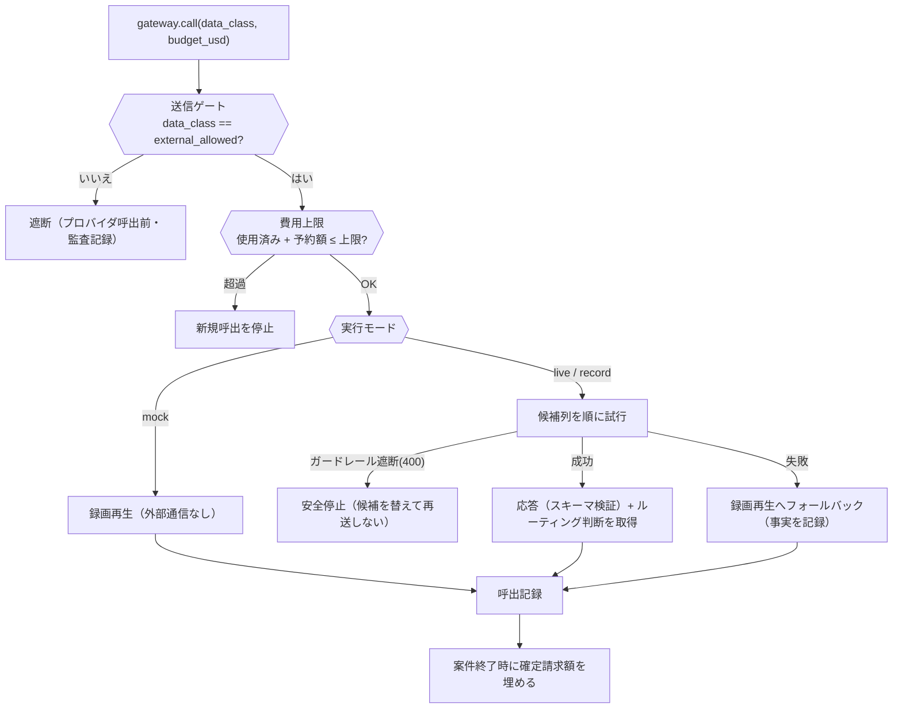

:::message
本記事は AIHACK2026 提出作品 **NetWalker** の設計解説です。
全体像とデモは [本編記事](https://zenn.dev/ZENN_USERNAME/articles/netwalker-aihack2026) を、
セキュリティ設計は [セキュリティ編](https://zenn.dev/ZENN_USERNAME/articles/netwalker-security) をご覧ください。
リポジトリ: https://github.com/GITHUB_OWNER/GITHUB_REPO
:::

## この記事で書くこと

「受注画面が開かない」という非専門家の申告から、AIエージェントが実際のネットワークを
調査し、人間の承認を経て復旧するまでを作りました。

本記事は**その中身の設計**、とくに次の3点について書きます。

1. LLM に環境を触らせずに自律性を出す構造
2. 「本番に触る前に複製環境で試す」をどう実装したか
3. モデル呼出をどう制御したか（費用・フォールバック・ルーティングの可視化）

---

## 全体構成

3プロセスに分けています。

```
Mac (ホスト)
├── sim/       Docker privileged コンテナ内の擬似ネットワーク
│              netns×5 (client—gw—{r1主,r2予備}—srv) を2系統（対象環境/検証用複製）
│              nginx の HTTPS 受注サービス・nftables の ACL・冗長化制御デーモン
│              制御API :9000（/agent/* = 診断ツール ↔ /admin/* = 注入・正解。分離）
├── backend/   FastAPI :8000（uv / Python 3.12）
│              案件の状態機械・承認管理・エージェント本体・構成図読取・
│              実行記録（SQLite）・SSE・フロント静的配信
└── frontend/  React + Vite + TS（/console /approve /ops）
```

ポイントは **sim が「絵」ではない**ことです。Linux の network namespace を10個
（対象環境5 + 検証用複製5）作り、nginx が本物の TLS で待ち受け、nftables が実際に
パケットを落とします。エージェントが実行する `curl` / `ip` / `nft` の出力が、
そのまま画面の証拠になります。

## 設計の核1: LLM に環境を触らせない

いちばん気をつけたのはここです。LLM は**観測結果の要約と次の一手の提案**にしか
使いません。設定を変える操作は、シミュレータ側のホワイトリストを必ず通ります。

```python
def check_plan(plan: Plan) -> None:
    """修正のホワイトリスト。ここを通らない変更は実行しない。"""
    if plan.node != "r2":
        raise HTTPException(403, f"変更が許可されているのは r2 のみです: {plan.node}")
    if plan.table != "fw" or plan.chain != "forward":
        raise HTTPException(403, "変更が許可されているのは table=fw chain=forward のみです")
    if plan.rule_comment.startswith("POLICY-"):
        raise HTTPException(403, "POLICY-* ルールの削除は禁止です")
    if not re.fullmatch(r"[A-Za-z0-9_\-]{1,64}", plan.rule_comment):
        raise HTTPException(422, "rule_comment の形式が不正です")
```

LLM が何を出力しようと、`POLICY-DENY-TELNET`（telnet を落とす正当な遮断ルール）は
消せません。**モデルが賢いから大丈夫**ではなく、**モデルが間違っても壊れない構造**に
したかった、という話です。

`subprocess.run` もリスト引数で呼び、シェルを経由しません。
LLM が生成した文字列がコマンドとして実行される経路は存在しません。

## 設計の核2: 自律性は「選べる手を絞る」ほうが出しやすかった

エージェントは固定の手順書を持ちません。観測履歴を要約してモデルに渡し、
次に実行するツールを**構造化出力（JSON Schema）**で決めます。

```python
DECIDE_SCHEMA = {
    "title": "next_action",
    "type": "object",
    "additionalProperties": False,
    "properties": {
        "action": {"type": "string",
                   "enum": ["observe_node", "probe_path", "test_business",
                            "test_forbidden", "propose_fix", "conclude_no_change"]},
        "node": {"type": "string", "enum": ["client", "gw", "r1", "r2", "srv", ""]},
        "aspects": {"type": "array", "items": {"type": "string",
                    "enum": ["link", "route", "addr", "nft", "listen", "failover"]}},
        # ... src / dst / kind / port / rule_comment / reason / hypothesis_update
    },
    "required": [...],
}
```

「自由にコマンドを書かせる」より「**選べる手を型で絞る**」ほうが、結果的に自律性を
上げやすかったのが発見でした。安全なだけでなく、モデルが迷いにくくなります。

実行の上限も型と同じ扱いで入れています。判断10ステップ・読取20回・案件あたりの
費用上限。上限に達したら決められた手順へ退避するか、人に返します。

### LLM の出力を鵜呑みにしない

モデルが「このルールを消せばいい」と言っても、そのまま計画にはしません。

```python
# 提案されたルールの実在確認（LLM出力を鵜呑みにしない）
r2obs = tools.observe_node(node, ["nft"])
nft_text = (r2obs["result"]["observations"]["nft"]["raw"] or {}).get("stdout", "")
rule_line = next((ln.strip() for ln in nft_text.splitlines()
                  if f'comment "{comment}"' in ln), None)
if rule_line is None:
    raise RuntimeError(f"提案されたルール({comment})が {node} に存在しません")
```

同じ考えで、モデルが「変更不要です」と結論した場合も、サーバ側で業務テストを
実行し直して裏を取ります（成功の捏造防止）。

## 設計の核3: 本番に触る前に、複製環境で試す

ここがいちばん手応えのあった部分です。修正案は必ず次の順で検証します。

1. 対象環境の状態（リンク・経路・nft ルールセット・待受ポート）を収集
2. **検証用の netns を作り、同じ状態をリプレイ**
3. 両環境を**正規化JSONで機械比較**し、さらに業務テスト・禁止通信テストの
   結果まで一致することを確認
4. 一致した複製環境で修正を適用し、業務テストと回帰テスト（禁止通信の遮断維持）
5. 合格して初めて承認依頼を出す

```python
def compare_envs() -> dict[str, Any]:
    """対象環境と検証用環境の一致判定（正規化JSON比較）。"""
    t, v = collect_state("t-"), collect_state("v-")
    mismatches: list[str] = []
    # リンク状態・経路・nft ルールセット・待受ポートを突き合わせ
    ...
    # 通信テストの結果も一致条件に含める
    checks = {
        "business_target": run_business_test("t-")["pass"],
        "business_verify": run_business_test("v-")["pass"],
        "forbidden_target": run_forbidden_test("t-")["pass"],
        "forbidden_verify": run_forbidden_test("v-")["pass"],
    }
    ...
    return {"match": not mismatches, "mismatches": mismatches, ...}
```

**一致しなければ承認待ちに進みません。** 「複製が本番と同じである」ことを機械で
確かめてから試すので、「検証環境では動いたのに本番で壊れた」を構造的に減らせます。

画面では変更前後を左右に並べて出しています。

> **本番に触る前に、そっくりな複製環境で試しました**
> ① 複製をつくった — 本番と同じ構成であることを確認
> ② 変更する前 — 業務通信 NG ／ 禁止通信 遮断されている
> ③ 変更したあと — 業務通信 OK ／ 禁止通信 遮断されたまま
> ④ 判定 合格 → だから本番に出せます

## 状態機械: 「分からない」で止まれること

案件は状態機械で管理し、`NEEDS_HUMAN` を**失敗ではなく安全な停止**として扱います。

```
RECEIVED → INVESTIGATING → VALIDATING_PLAN → AWAITING_APPROVAL
         → APPLYING → VERIFYING → SERVICE_RESTORED → RESOLVED
         ↘ ROLLING_BACK ↘ NEEDS_HUMAN ↘ CANCELLED
```

`NEEDS_HUMAN` へ落ちるのは、たとえば次のときです。

- 複製環境が本番と一致しなかった
- 適用直前に前提が変わっていた（対象ルールが既に消えていた等）
- 判断ステップ・読取回数・費用の上限に達した
- ゲートウェイのガードレールが送信内容を遮断した
- 適用後の検証に落ちた（この場合は先に登録済みの復元を実行）

### 適用直前にもう一度観測する

承認から適用までの間に状況が変わっているかもしれません。適用の直前に
「対象ルールがまだあるか／業務は止まったままか／使っている経路は同じか」を
再観測し、ズレていたら古い計画を適用せず止めます。

業務が既に回復していたら、**変更を適用せず検証だけ**して終わります。

### 却下も行き止まりにしない

承認者が却下したときは、引き継ぎレコードを起票します。却下者・時刻・却下理由・
これまでの証拠と計画への参照・担当候補を記録し、画面には

- もう一度調べ直す（**障害状態はそのままに**新しい案件を開始）
- 担当者に引き継ぐ（受領／保留を記録）
- デモを初期状態へ戻す

の3つの出口を出します。却下は失敗ではなく**正常な安全動作**なので、
そこから先に進める道が要る、という考えです。

## モデル呼出の制御



### モデル名をコードに書かない

候補列・単価・上限・**画面から選べるモデル**はすべて YAML で宣言しています。

```yaml
profiles:
  decide:
    max_cost_usd: 0.03
    response_format: json_schema
    strict: true
    routes:
      - orcarouter/fusion-flash   # 製品のルーティングに委ねる
      - openai/gpt-5.4-nano       # 落ちたら検証済み固定モデルへ
      - openai/gpt-4o-mini
```

方式の切替（高性能固定／製品のルーティング／自前フォールバック／LLM不使用）も
この YAML の variant で行い、比較実測に使います。

### 費用は「推定」と「実請求額」を分ける

最初は「ルータは原価を返さない」と思い込んで単価表 × トークン数で推定していましたが、
応答ヘッダの request id を費用照会APIに投げると**確定請求額が返る**と分かりました。

そこで二本立てにしました。

| | 何を使うか | なぜ |
|---|---|---|
| 呼出**前**の予算判定 | 単価表 × トークン数（推定） | 実費は事後にしか出ない |
| 表示・評価 | 費用照会APIの確定額（**実請求額**） | 推定で語らない |

ここで穴がありました。**Named Router や無料枠は単価が公開されません**（`pricing: null`）。
単価不明を「0円」として扱うと、**費用上限が事実上無限になります**。
保守的な上振れ単価で見積る経路を足して塞ぎました。

```python
def budget_cost_usd(self, resolved_model, input_tokens, output_tokens, route=None) -> float:
    """費用上限の判定に使う保守的な額。単価不明でも 0 にしない。"""
    est = self.estimate_cost_usd(resolved_model, input_tokens, output_tokens, route)
    if est is not None:
        return est
    p = self.unknown_pricing
    if p and input_tokens is not None and output_tokens is not None:
        return (input_tokens * p["prompt_per_million"]
                + output_tokens * p["completion_per_million"]) / 1_000_000
    return self.max_cost_usd
```

### ルーティング判断を画面に流す

応答ヘッダから「どのモデルが、どの戦略で、何段目の候補で選ばれたか」を取り出し、
調査ログに1行として流しています。

```
AIの判断3：予備回線ルータの通信ルールを確認します
  OrcaRouter が balanced 戦略で openai/gpt-oss-120b を選択（fallback 0）
```

判断ごとに解決先モデルが変わる様子がそのまま見えるので、
「モデル選択に価値がある」ことの最も直接的な証拠になりました。

## 候補モデルは実タスクで検証してから採用する

単価表を眺めるだけでは分からないことがありました。判断1ステップと構成図読取を
同じ入力で回す検証スクリプトを書いて、15モデル × 2タスクを実測したところ:

- **単価が最安のモデルは構造化出力に不合格**。しかも 400 ではなく
  **200 を返してスキーマに適合しない**（＝課金されるのに採用できない）
- **それまでの第一候補は、構成図の接続を5本中4本しか読めていなかった**
- 無料枠はどれも完走しない（レート制限・課金エラー）

合格したものだけを候補列と画面の選択肢に載せる、という運用にしました。
詳細は [本編記事](https://zenn.dev/ZENN_USERNAME/articles/netwalker-aihack2026) に載せています。

## 画面のつくり: 文言を二層に分ける

4分の発表で審査員に非エンジニアが含まれる、という前提だったので、
**画面そのものがプレゼン**になります。とはいえ技術用語を消すと、技術がある人には
逆に薄く見えます。

そこで表示層と技術層を分けました。バックエンド側は次のように書くだけです。

```python
publish_step(incident_id,
             "予備回線ルータの通信ルールを確認します",   # 画面に出る平易層
             tech_title="observe_node r2 [link, nft]",  # 技術詳細モーダル側
             tech_detail="...")
```

状態遷移も、それまで「注記がそのまま画面見出しになる」構造だったのを、
注記は技術層へ・見出しは状態ラベル由来に変えるだけで**18箇所が一括で平易化**
されました。文字列を1つずつ直すのではなく、**どこで文字列が画面に漏れているか**を
直すほうが早い、というのが学びです。

## 参考

- リポジトリ: https://github.com/GITHUB_OWNER/GITHUB_REPO
- [本編記事](https://zenn.dev/ZENN_USERNAME/articles/netwalker-aihack2026)
- [セキュリティ編](https://zenn.dev/ZENN_USERNAME/articles/netwalker-security)
