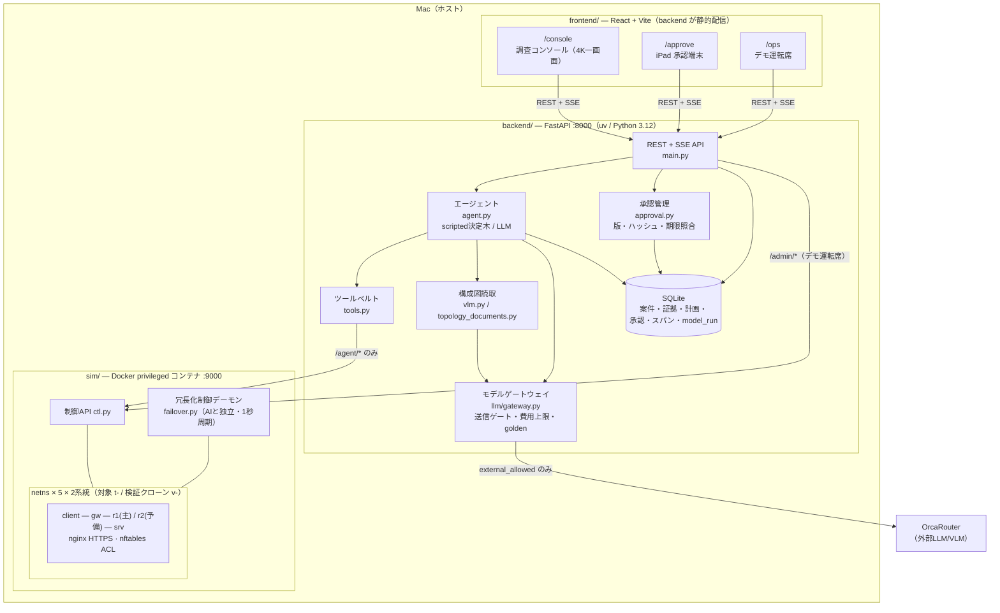
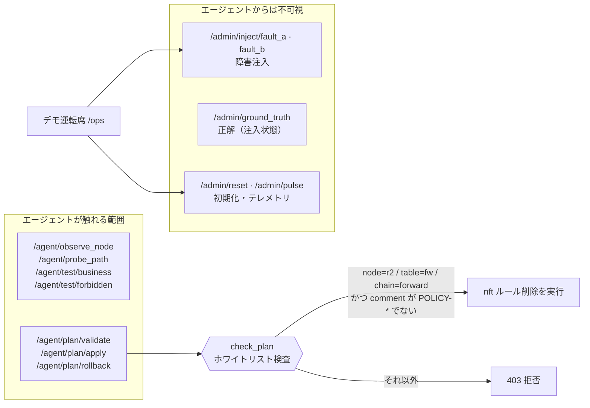
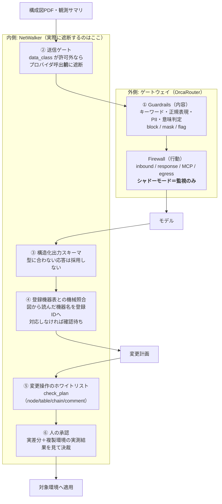
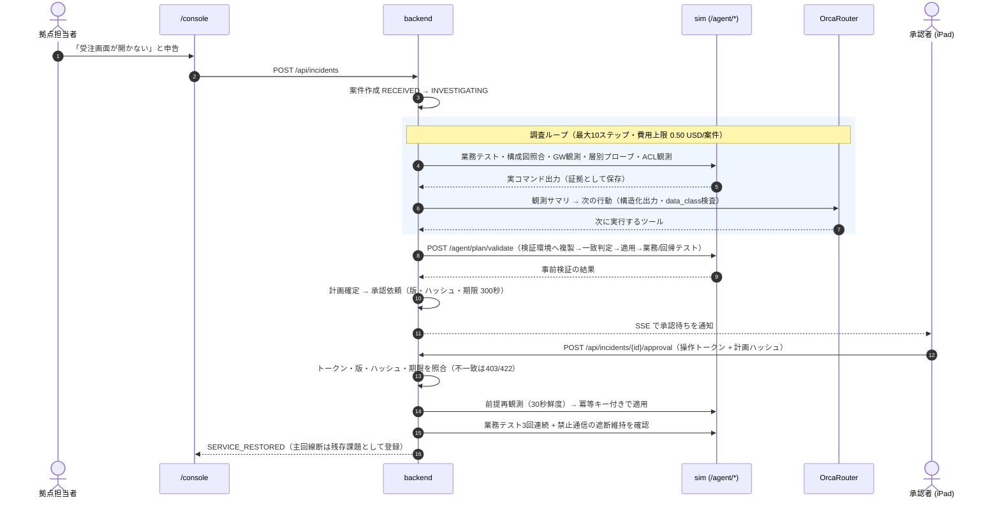
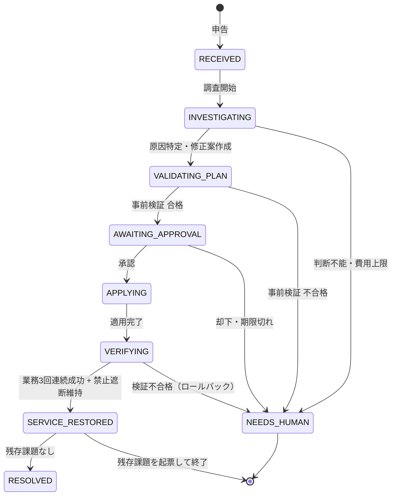
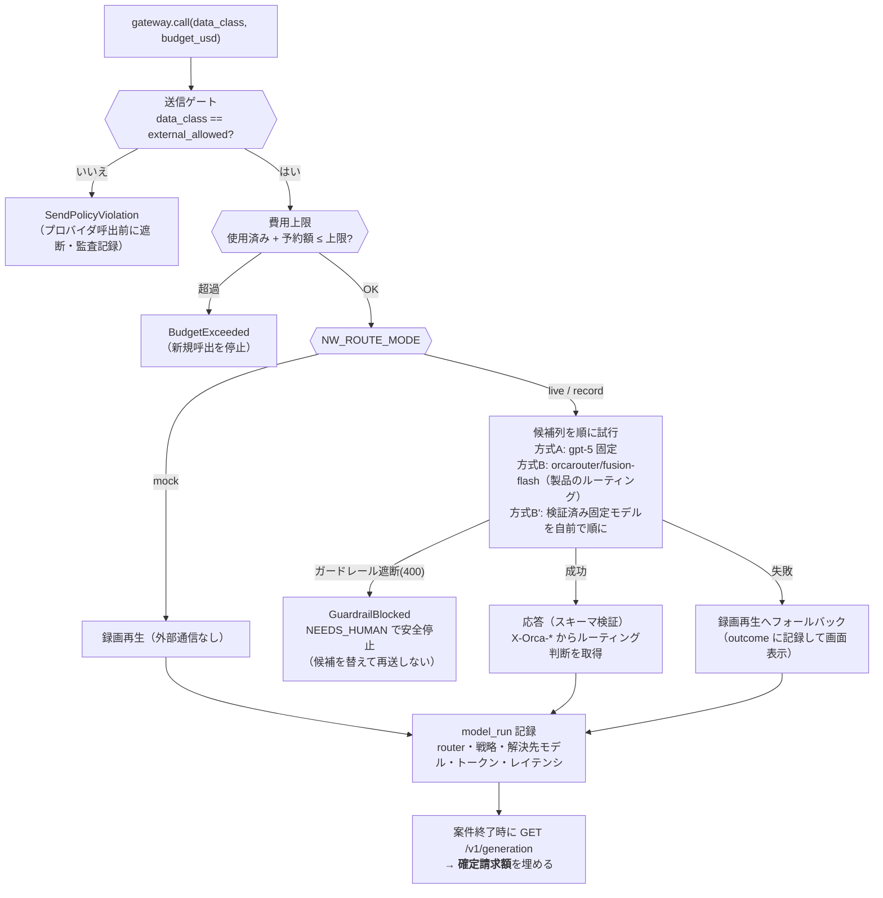

# NetWalker アーキテクチャ

「受注画面が開かない」という非専門家の申告から、複合障害の特定・事前検証・
人間の承認・適用・独立検証までを一本の流れで行う。設計上の核は次の3点。

1. **調査は実測のみ** — LLM の推測ではなく、`curl` / `ip` / `nft` の実コマンド出力が証拠
2. **LLM は環境に触れない** — 変更操作はシミュレータ側のホワイトリストを必ず通る
3. **適用には人間の承認** — 計画の版・ハッシュ・期限をサーバが照合する

## 全体構成

## 信頼境界

シミュレータの制御APIは**用途の異なる2系統**に分かれており、これが本作の中心的な
信頼境界になっている。

- エージェントは**正解を一切参照できない**。`/admin/ground_truth` はデモの答え合わせ専用
- 変更操作は `sim/ctl.py:295 check_plan` を必ず通る。LLM が生成した任意コマンドは実行しない
- `rule_comment` は `[A-Za-z0-9_\-]{1,64}` に限定（コマンド注入対策）
- 冗長化制御 `failover.py` は AI と独立に動く。切替が起きても AI の手柄にしない
  （画面にも「機器が自動切替（AIの操作ではありません）」と明示する）

## 多層防御（ゲートウェイ層 + アプリ層）

安全性は1枚の壁ではなく、**性質の違う6層**で担保する。外側（OrcaRouter）と
内側（NetWalker）に分かれているので、片方をすり抜けても、もう片方の記録に残る。

| 層 | 誰が | 止めるもの | 実装 |
|---|---|---|---|
| ① ガードレール | OrcaRouter | 送信内容（注入・PII・ジェイルブレイク） | OrcaRouter 側の設定 |
| ② 送信ゲート | NetWalker | 外部送信不可のデータ | `backend/app/llm/gateway.py:90` |
| ③ スキーマ | NetWalker | 型に合わない応答 | `GRAPH_SCHEMA` / `DECIDE_SCHEMA` |
| ④ 機械照合 | NetWalker | 図と実態の食い違い | `backend/app/vlm.py` `compare_graph` |
| ⑤ ホワイトリスト | NetWalker | 許可範囲外の変更操作 | `sim/ctl.py:295` `check_plan` |
| ⑥ 人の承認 | 人間 | 人が納得しない変更 | `backend/app/approval.py` |

**正直に書くこと**: OrcaRouter のファイアウォールは**シャドーモード（監視のみ）**で
運用している。評価と記録は本番同様に行うが、遮断系の判定は `audit` に格下げされる。
つまり**実際に操作を止めているのは ④⑤⑥**である。ゲートウェイの記録は
**独立した第二の判定**として、NetWalker の判断と突き合わせるために使う。

案件ごとに「どの層が何件を通し、どこで何件を止めたか」は画面の
「技術詳細 → この案件で通った防御層」で確認できる
（`frontend/src/components/DefenseLayers.tsx`）。
共通基準との対応は [security-owasp.md](security-owasp.md)、
実測記録は [evidence/orcarouter-guardrails.md](evidence/orcarouter-guardrails.md)。

## 調査から復旧までのデータフロー

## 各層の責務

| 層 | 責務 | 主なファイル |
|---|---|---|
| sim | 実通信を伴う擬似ネットワーク。型付きツールAPIと変更ホワイトリスト | `sim/ctl.py` `sim/topo.sh` `sim/failover.py` |
| backend / 状態 | 案件状態機械・証拠・計画・承認・スパンの正本（SQLite） | `app/incident.py` `app/db.py` |
| backend / 判断 | 観測→仮説→計画。scripted 決定木と LLM の2実装 | `app/agent.py` |
| backend / 実行 | ツール呼出と証拠化（生出力をそのまま保存） | `app/tools.py` |
| backend / 承認 | 版・ハッシュ・期限・冪等性の検証 | `app/approval.py` |
| backend / モデル | 候補列・費用上限・送信ゲート・golden再生 | `app/llm/gateway.py` `app/llm/route_policy.yaml` |
| backend / 構成図 | 登録機器表との機械照合（PDFアップロード対応） | `app/vlm.py` `app/topology_documents.py` |
| frontend | 調査の可視化・承認UI・デモ運転 | `src/ConsolePage.tsx` `src/components/Approval.tsx` |

## 状態機械

`NEEDS_HUMAN` は失敗ではなく**安全な停止**として扱う。自信がないまま適用に進むより、
人間に判断を戻すほうが正しい、という方針を状態機械に埋め込んでいる。

## モデル呼出の制御

キー未設定・API障害でも録画再生でデモが成立する。ただし**フォールバックした事実は
隠さず** `outcome` と画面のルート表示に残す。

### 費用の二本立て（誠実性のため分ける）

| | 何を使うか | なぜ |
|---|---|---|
| **呼出前の予算判定** | `route_policy.yaml` の単価表 × トークン数（推定） | 実費は事後にしか出ないため |
| **表示・評価** | `GET /v1/generation` の `total_cost`（**確定請求額**） | 推定で語らないため |

Named Router や無料枠は単価が公開されない。**単価不明を0円扱いにすると費用上限が
無限になる**ため、予算判定には保守的な上振れ単価（`unknown_model_pricing`）を使う
（`route_policy.py` の `budget_cost_usd`）。

### ルーティング判断の可視化

`orcarouter.py` は `with_raw_response` で `X-Orca-Route` / `X-Orca-Router` /
`X-Orca-Resolved-Model` / `X-Orca-Request-Id` を取得する。
画面の調査ログには判断ごとに
「OrcaRouter が balanced 戦略で ◯◯ を選択（fallback 0）」と1行で流れるので、
**判断ごとに違うモデルが選ばれる様子**がそのまま見える。

候補モデルは `backend/scripts/bench_models.py` で実タスク検証してから採用する
（[evaluation/models.md](evaluation/models.md)）。方式A/B/B'/Rの実測比較は
[evaluation/results.md](evaluation/results.md) を参照。

## 関連ドキュメント

- [審査5項目アピール](judging.md) — 実装証拠・デモでの見せ場・実測値
- [A/B/B'/R 比較実測](evaluation/results.md) — コストパフォーマンスの根拠
- [候補モデルの実タスク検証](evaluation/models.md) — 何を採用し、何を落としたか
- [OWASP 対応表](security-owasp.md) — Top 10:2025 / Agentic ASI01–ASI10
- [T-11 攻撃耐性の検証記録](evidence/T-11.md) — プロンプトインジェクション・API直叩き
- [ゲートウェイ側の記録](evidence/orcarouter-guardrails.md) — ガードレール／ファイアウォール
- [要件定義書](requirements/NetWalker.md) / [UI仕様](design/ui-spec.md) / [デモ台本（4分版）](demo-script.md)
