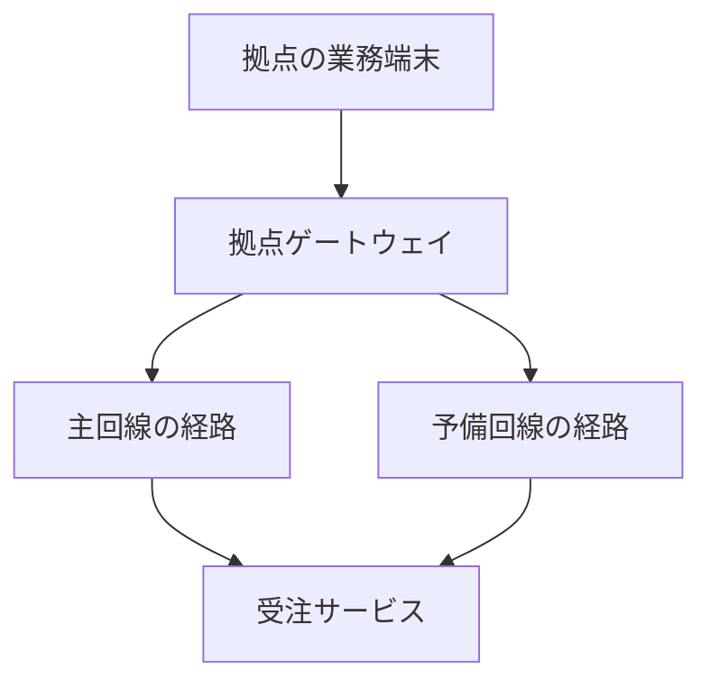

# NetWalker 要件定義書

> 構成図と実測をもとにネットワーク障害を自律的に調査し、人間と協調して業務再開まで導くAIエージェント。

| 項目 | 内容 |
| --- | --- |
| バージョン | v0.2：多角的レビュー反映版 |
| 作成日 | 2026年9月20日 |
| プロジェクト | AIHACK2026 / NetWalker |
| 想定読者 | プロダクト責任者、開発者、デモ・評価担当者 |
| 対象 | ハッカソン提出版と、その後の拡張 |
| 優先度 | **Must＝提出版で満たす要件、Want＝Must成立後に追加する要件** |
| 文書の位置づけ | v0.1に対するレビュー12件を反映。要件・試験を改訂したもので、実装済み・試験合格を意味しない |

本書では「Want」を希望・拡張要件の意味で用いる。機能の優先度と技術の採用状況を分け、過去に検討しただけの製品・方式を採用済みとして扱わない。数値目標・具体的な障害条件・内部APIは、本書で追加した設計案である。

### 改訂概要

| 改訂項目 | v0.2での変更 |
| --- | --- |
| 顧客価値 | 担当交代後の再入力不要、引き継ぎの受領、残存課題の管理を具体化 |
| 技術の成立条件 | 経路切替、検証環境の複製・一致確認、VLMの品質と探索への寄与を明記 |
| 評価 | モデル比較36試行と固定手順18試行を定義し、正常判定と復旧評価を分離 |
| 保護と回復 | 派生データの送信制約、観測の鮮度、再起動後の状態照合を追加 |
| 実行計画 | 依存先の疎通を最初に確認し、Mustの属性・担当・完了証拠を整理 |

Mustは機能20項目・非機能8項目、Wantは10項目を維持する。受け入れ試験は14項目から23項目へ拡充し、レビューとの対応を第17章に記載する。

## 1. 要件の要約

**解決する問題は、障害発生時に利用者が複数の窓口をたらい回しにされ、状況説明と切り分けを繰り返すことである。** NetWalkerは一つの案件に症状・構成・証拠・対応履歴を集め、調査先と次の行動を選び、業務通信の復旧を確認する。

提出版では、次の一連の体験を成立させる。

1. 拠点担当者が「業務画面が開かない」と申告する。
2. 構成図から機器・接続関係を読み取り、許可された範囲の実測と照合する。
3. 最初の原因候補だけで説明できない結果を受けて、追加調査する。
4. 複合障害の原因と、根拠のある修正案を示す。
5. 隔離した検証環境で修正を試し、担当者がiPadで変更を承認する。
6. 承認された変更だけを適用し、業務通信の成功と副作用の有無を検証する。
7. 対応記録と残存課題を保存する。担当者が交代しても同じ案件を参照し、利用者に症状の再入力を求めず次の対応へ進む。外部事業者への実際の連絡・受領は、人間の対応として管理する。

| 区分 | 実現する内容 |
| --- | --- |
| **Must：価値の中心** | 一案件での横断切り分け、観測に応じた探索、複合障害の診断、修正前検証、承認、適用、復旧確認、引き継ぎ |
| **Must：技術・実証** | VLMによる構成図読取、構造化グラフ、実通信が変化するエミュレータ、OpenTelemetry、OrcaRouter比較評価、DGX SparkでのローカルLLM処理、Mac/iPadデモ |
| **Want：差別化の拡張** | Jevによる次行動選択、構成図理解の追加学習、障害種別拡充、実機接続、継続監視、完全オフライン処理 |
| **成立の証拠** | 「なぜ次の調査を選んだか」「何を変更したか」「利用者の業務が本当に再開したか」を実行記録で確認できる |

## 2. これまでの検討から引き継ぐ方針

| 方針 | これまでの位置づけ | 本書への反映 |
| --- | --- | --- |
| 原体験は障害時のたらい回し | ユーザーが明示 | 案件の一元管理と根拠付き引き継ぎをMustとする |
| 無線・有線・サーバ、自社・通信事業者を横断して被疑箇所を絞る | ユーザーの希望 | 責任範囲・観測可能範囲・未確認範囲を区別して表示する |
| 人間でも見つけにくい複合事象を扱う | ユーザーが重視 | 単一の原因発見で終了しない探索をMustとする |
| 構成図から探索するVLM/Scene Graph | 継続して検討 | 図の読取と構造化をMust、追加学習をWantとする |
| シミュレータを使い、見栄えと再現性を両立する | ユーザーの希望 | 実際の通信を伴うエミュレーションをMustとする |
| OpenTelemetryを組み込む | 過去の要望 | 業務側の観測とエージェント側の実行記録をMustとする |
| DGX SparkでローカルLLMを使う | ユーザーが明示 | 主要処理のローカル実行をMustとする。実機利用可否は着手時に確認する |
| OrcaRouterの比較を活かす | ユーザーの希望・選定資料の提案 | 同一条件でのモデル選択方式の比較をMustとする |
| Jevを組み込む | 組み込み相談・提案段階 | 限定した判断処理への導入をWantとし、効果と利用条件を検証する |
| MacとiPadでデモする | ユーザーが所有端末を提示 | 調査画面と承認画面の同期をMustとする |

**Must / Wantの具体的な切り分けは本書の提案であり、過去に全項目が合意済みという意味ではない。** 開発工数の小ささだけで中心価値を削らず、まず閉じた一連の動作を作り、その後にWantを追加する。

## 3. 利用者・顧客・解決する仕事

### 3.1 利用者と役割

| 役割 | 困りごと | NetWalkerで行うこと |
| --- | --- | --- |
| 拠点担当者 | 業務が止まり、どこに連絡すべきか分からない | 症状を一度入力し、対応状況と業務再開を確認する |
| 情シス・ネットワーク運用担当者 | 複数機器・窓口の情報が分散し、切り分けに時間がかかる | 証拠、原因候補、検証結果、変更内容を確認する |
| 変更承認者 | 変更の影響と戻し方が見えず、判断できない | 対象・差分・影響・検証・復元条件を確認して承認／却下する |
| 外部保守・通信事業者 | 情報不足の問い合わせで再確認が増える | 整理済みの証拠と依頼内容を受け取る。提出版では引き継ぎ文書の生成まで |

初期顧客は「少人数の情シスで複数拠点を支える企業」、導入判断者は情シス責任者を想定する。これは顧客仮説であり、需要・支払意思・導入効果は未検証である。

### 3.2 自律化する範囲

| 自律的に行う | 人間が判断する | 権限外として扱う |
| --- | --- | --- |
| 情報収集、仮説更新、次の調査選択、隔離環境での修正検証、報告生成 | 対象環境への設定変更承認、未確認の影響の判断、外部への連絡・依頼 | 未登録機器へのアクセス、許可外ネットワーク探索、通信事業者側の設定変更 |

対象機器・観測項目・通信先は導入時に登録し、調査開始時には案件の対象範囲として参照・確認する。構成図に機器が描かれていることは、アクセス権限を意味しない。

### 3.3 導入時と障害発生時を分ける

| 段階 | 担当 | 必要な準備・操作 | 完了条件 |
| --- | --- | --- | --- |
| 導入時 | 情シス・管理者 | 構成図、機器対応表、接続資格情報、許可操作、業務テスト、担当領域、送信区分、承認者を登録 | 登録先へ接続でき、正常時の業務・禁止通信を確認できる |
| 構成変更時 | 情シス・管理者 | 図・対応表・権限・担当・成功条件の版を更新 | 更新対象と時刻が残り、古い案件の承認は必要に応じて失効する |
| 障害発生時 | 拠点担当者 | 拠点・対象業務・症状を選択／入力 | 技術的な接続情報を再登録せず調査へ進む |
| 引き継ぎ時 | 情シス・担当者役 | 同じ案件の証拠と次の作業を確認し、受領／保留を記録 | 利用者へ既に回答済みの症状を再入力させない |

提出版では外部窓口への送信を自動化せず、引き継ぎ先の候補・確認済みを区別し、担当者役が受領状態を更新する。これを現実の通信事業者が対応した証拠とは扱わない。導入・更新の作業時間も計測し、API費用と別に示す。

## 4. 提出版の範囲

| 項目 | Mustで扱う範囲 | Wantで広げる範囲 |
| --- | --- | --- |
| 案件 | 一拠点・一案件・一つの代表業務通信 | 複数拠点・複数案件・影響の連鎖 |
| 構成図 | PNG/JPEGの構成図1枚、機器・リンク・業務サービス | 複数ページPDF、複雑な図面、写真、各社独自の記号 |
| 構成規模 | 4〜6ノード程度の固定トポロジーから開始 | 大規模・動的トポロジー |
| 障害 | 複合障害1系統の未使用パラメータ条件、単独障害、正常系 | MTU/ICMP、DNS、非対称経路、無線品質など |
| 実行環境 | 隔離したLinuxネットワークエミュレータ | 許可を得た実機・検証拠点 |
| 自動変更 | 検証済みの限定操作を、承認後に適用 | より多い機器・設定形式・変更パターン |
| モデル | ローカルLLMと、送信可能データに限定したOrcaRouter経由のモデル | Jev、追加学習VLM、全処理のローカル化 |
| UI | Macの調査画面、iPadの承認・復旧確認画面 | 音声、チャットサービス、既存運用ツール |

無線・有線・サーバを分類する情報モデルはMustに含める。ただし、提出版のエミュレータで無線電波の物理的な干渉まで再現したとは主張しない。

今回の対象外は、本番ネットワークへの無承認変更、全機器ベンダーへの対応、通信事業者設備の直接制御、汎用ヘルプデスク全業務の代行である。

## 5. Must：機能要件

### 5.1 受付・構成理解・自律探索

| ID | 要件 | 受け入れ基準 |
| --- | --- | --- |
| M-01 | **症状と完了条件を一案件にまとめる。** 導入済みの拠点設定を参照し、症状・対象業務・許可範囲・担当を保持する | 非専門家が接続情報を再登録せず申告できる。症状と証拠を調査・承認・報告・引き継ぎへ引き継ぎ、同じ内容の再入力を求めない |
| M-02 | **VLMで構成図を構造化する。** 機器・リンク・識別子・役割を抽出し、原図の根拠と結び付ける | 実推論の未修正出力と訂正後を保存し、正誤・訂正件数・時間を測る。実行に必要な識別子・接続関係は実測または管理者確認で裏付け、不明なら確認待ちにする。T-17と第12.5節で利用価値を評価する |
| M-03 | **図と実態の差を管理する。** 図由来・管理者確認済み・実測由来を区別する | 版・時刻・証拠・有効期限を保持し、古い図を上書きせず差分を表示する。未知・失効した状態を正常と扱わず、変更前提となる観測を適用直前に再確認する |
| M-04 | **許可されたツールで横断切り分けする。** 接続、DNS、TCP/HTTPS、経路、インターフェース、設定、ログを調べる | 指定した機器・通信先だけを検査し、結果・時刻・エラーを保存する。実行不能・権限不足と、検査対象の異常を区別する |
| M-05 | **観測から仮説と次の行動を更新する。** 支持証拠・反証・識別したい条件を保持する | 調査先またはツールを選んだ根拠が観測と対応する。未使用条件と固定ランブックで比較し、固定の操作列だけで全試行を処理しない。比較で差がなければ探索の優位性を主張しない |
| M-06 | **複合障害を説明する。** 第一の原因だけで未復旧を説明できない場合に探索を継続する | 主デモで二つの要因を証拠付きで示す。正常／単独／複合の条件で結論が変わり、障害注入用の正解情報を推論入力に含めない |

### 5.2 検証・承認・変更・復旧

| ID | 要件 | 受け入れ基準 |
| --- | --- | --- |
| M-07 | **通信が実際に変化する隔離環境を用意する。** 故障点・切替制御・収束条件・ACL位置を固定する | AIなしで正常・各単独障害・複合障害と修正後を再現する。業務・禁止通信の期待結果がそろい、初期化できる。環境準備の失敗は記録し、モデルの結果と混同しない |
| M-08 | **修正案を事前検証する。** 計画の差分・前提・影響・復元方法を確定し、管理系が複製した検証用環境で試す | 変更前の対象環境と検証用環境で、登録した設定・リンク／サービス状態・業務／禁止通信の一致を確認する。不一致・再現不能なら承認待ちへ進めない。正解ラベル・注入定義はエージェントへ渡さない |
| M-09 | **人間が変更内容を確認して承認する。** 対象・計画版・設定前提・観測前提・期限に紐付ける | 認証した承認者のみが承認／却下できる。未承認・失効・競合・前提変化では適用しない。iPadの操作がMacに反映され、必要な再観測と設定照合を適用直前に実行する |
| M-10 | **承認された差分のみ適用する。** 実行中状態、適用前状態、操作ID・冪等キーを永続化する | 二重送信と再起動で変更を二重適用しない。適用結果不明なら実状態を読み取りで照合し、盲目的に再送しない。登録した復元を実行し、復元不能は未解決として引き継ぐ |
| M-11 | **独立した業務テストで復旧を判定する。** 診断を担当するLLMとは別の検証器で、事前登録した業務操作を確認する | DNS/TCPの成功だけで完了しない。利用者と同等の経路でHTTPS応答・期待する内容・回帰テストを確認し、変更前後の結果を保存する |
| M-12 | **停止・復元・引き継ぎを扱う。** 未解決の理由、証拠、担当候補、次の作業、受領・保留、残存課題を同じ案件に保存する | 未復旧を完了にしない。担当者役の交代後も同じ案件で対応を開始でき、既入力の症状を再入力させない。受領更新は手入力でよい。担当が不明なら候補と表示し、T-15で確認する |

検証用環境への変更は、調査開始時に許可した実験操作の範囲で実行する。デモで本番役を担う「対象環境」への変更は、エミュレータ内であってもM-09の承認を通す。

### 5.3 画面・観測・モデル・評価

| ID | 要件 | 受け入れ基準 |
| --- | --- | --- |
| M-13 | **Macで調査の進行を可視化する。** 構成図、探索位置、仮説と証拠、変更候補、業務状態を表示する | 現在調査中の対象と、確認済み／未確認／異常が分かる。証拠を開いて観測結果を確認できる。アニメーションは実際のイベントに連動する |
| M-14 | **iPadで承認と業務確認を行う。** 別端末でも同一案件・同一計画版を扱う | 変更対象・差分・影響・事前検証・復元条件を表示する。再接続時に最新状態を取得し、古い画面からの承認を拒否する |
| M-15 | **OpenTelemetryで二つの流れを観測する。** エージェントの調査・モデル・ツール・承認・変更と、業務アプリのリクエストを記録する | 案件IDからエージェントの実行記録と業務検証の記録をたどれる。アプリに到達しない通信も、クライアント側の失敗として記録する |
| M-16 | **DGX Spark上のローカルLLMを主要処理に使う。** 提出版は観測ログの構造化要約を担当させる | 実機で作った証拠ID付き要約を探索が参照し、実行先・モデル・時間・送信区分を記録する。元の観測結果も参照できる。ローカル専用入力と派生データを外部へ自動転送しない |
| M-17 | **OrcaRouterでモデル選択を比較可能にする。** 候補を限定し、定型処理・難しい判断・代替経路を設定する | 固定方式と段階別選択方式を切り替えられる。要求モデル、実際のモデル、選択理由の要約、呼出回数、時間、利用量、費用を記録する |
| M-18 | **実行権限とデータ送信範囲をコードで強制する。** 操作権限と、原文・派生データ・再試行・観測転送の制約を扱う | 入力文で権限が増えず、許可外機器・未承認書込・登録外操作を拒否する。全送信先へ同じ送信区分を適用する。資格情報をブラウザや推論入力へ配布しない |
| M-19 | **再現可能な比較評価を残す。** 知覚・探索・モデル選択を分け、正常判定と復旧を別集計する | 第12章の条件を評価前に固定し、未使用条件・固定手順を含む全試行を記録する。分子・分母・試行数と失敗費用を示す。比較を実施することと、優位性が確認できることを区別する |
| M-20 | **第三者が確認できる提出物を用意する。** ソース、起動・初期化手順、シナリオ、評価結果、デモ説明をまとめる | 使用したバージョン・モデル・設定・制約を記載する。外部アカウントが必要な箇所を明示し、実装済み・録画・未実装を区別する |

M-16はローカル推論の実利用を求める。全工程の完全オフライン化はW-06とする。機材が利用できずMustを変更する場合は、要件変更として記録し、未達を隠さない。

## 6. Want：拡張要件

WantのID順は実装順を意味しない。Mustの計測結果から、図の誤読、判断時間、費用などの制約が明らかになったものを優先する。Jevを最初に追加することは固定しない。

| ID | 拡張内容 | 価値・採用条件 | 主な制約 |
| --- | --- | --- | --- |
| W-01 | **Jevによる次の調査選択** | 許可済み候補から次の読取操作を選ぶ。LLMのみの方式と比べ、診断品質を保ちながら判断の時間・費用が改善する場合に採用 | API利用可否、対象ドメインでの確信度校正、誤った候補選択への対処が必要 |
| W-02 | **Scene Graphを使うVLMの追加学習** | 構成図読取が下流の復旧成功率を制約する場合に実施。グラフから画像・正解データを生成し、未見レイアウトで評価 | 学習データの様式に過適合する可能性。追加学習そのものを目的にしない |
| W-03 | **複合障害シナリオの拡充** | MTU/ICMP、DNS、非対称経路などを追加し、未知の組合せへの対応を評価 | 各障害をエミュレータで再現・検証できることが前提 |
| W-04 | **実機・複数ベンダー接続** | 許可を得た検証機器で同じツール契約を使い、実運用とのギャップを調べる | コマンド差、権限、設定復元、製品ライセンスへの対応が必要 |
| W-05 | **構成図から検証環境を生成** | 構成図・設定からエミュレータ定義の候補を生成し、人間が対応関係を確認する | 図だけでは経路・ACL・状態を復元できない。追加情報が必要 |
| W-06 | **全処理のローカル実行** | VLM・計画・説明を含め、外部APIが使えない状態でも案件を処理する | モデル品質、メモリ、推論速度、画像入力対応を検証する必要がある |
| W-07 | **予兆検知・夜間の事前調査** | 許可範囲で障害を検出し、翌朝までに証拠と変更案を準備する | 誤検知、観測負荷、通知運用の設計が必要。対象環境の変更承認は維持する |
| W-08 | **既存チケット・チャット連携** | 案件と証拠を外部ツールへ引き継ぎ、再説明を減らす | 送信先、権限、データ範囲の管理が必要。提出版では文書出力で代替する |
| W-09 | **障害履歴の検索と類似事例の再利用** | 過去の成功・失敗から調査候補を改善し、再発防止案を提示する | 古い構成や誤診断を新しい案件へ持ち込まない仕組みが必要 |
| W-10 | **複数拠点と事業影響の優先付け** | 同時障害で影響する業務・拠点を特定し、復旧順序を支援する | 業務依存関係、影響算定、同時変更の調整が必要 |

### 6.1 Jevを追加する場合の契約

Jevの公式説明では、状態に対する型付き質問から構造化された判断を返す。Choiceは選択肢・確率・確信度を扱うため、NetWalkerでは「次の読取検査を選ぶ」という限定した用途を候補にする。[TypeSafe AI公式ドキュメント](https://docs.typesafe.ai/introduction)

- 入力：観測の要約、未解決の仮説、コード側が生成した許可済み検査候補。
- 出力：候補IDと、利用可能な確率・確信度。具体的なフィールドは導入時のAPIで確認する。
- フォールバック：応答不正、時間切れ、候補外、判断不十分の場合はLLMによる選択へ戻す。
- 権限：Jevは操作権限を付与せず、対象環境への変更を直接実行しない。
- 評価：正しい次行動の選択率、判断を委ねた割合、遅延、費用、最終的な復旧成功率を測る。
- 確信度：過去の案にあった固定閾値を確定仕様にしない。対象データで校正・選定し、評価データとは分ける。

Jevは行動選択、OrcaRouterはモデルの呼び分けを担当する。役割が異なるため併用を検討できるが、両方を入れること自体を成功条件にはしない。

## 7. 主デモの障害シナリオ

### 7.1 再現する状況

**利用者の訴え：拠点の受注画面が開かない。機器は動いているように見え、どの窓口に連絡すればよいか分からない。**

主デモの具体的条件は、本書で採用する初期案であり、実装時に再現性を確認して固定する。

| 要素 | 初期案 |
| --- | --- |
| 通常時 | 主回線を利用し、予備回線への切替経路を用意しておく |
| 障害A | 主回線側のリンクを停止する |
| 障害B | 予備経路のACLに、受注サービス向けHTTPS通信を誤って遮断する設定がある |
| 複合時の見え方 | 主回線から予備経路へ切り替わっても業務が再開しない。疎通の一部は成功する |
| 必要な調査 | 経路・リンク状態と、TCP/HTTPS・ACLの照合。主回線停止だけでは未復旧を説明しきれない |
| 変更候補 | 許可対象の拠点・サービス・ポートに限定して、予備経路の誤ったACLを修正する |
| 回帰テスト | 対象業務が通り、登録した禁止通信は引き続き遮断される |
| 業務復旧後 | 予備経路で業務を再開する。主回線停止は残存課題として担当者・対応内容を記録する |

ACLを全面解除して業務通信を通す案は、回帰テストに不合格とする。物理断に相当する障害Aをソフトウェアだけで直したことにはしない。

### 7.2 経路切替と通信条件を固定する

本節は提出版の実装契約であり、動作確認済みという意味ではない。第14章の最初のゲートで手動再現し、使用した環境定義を固定する。

| 項目 | 提出版の定義 |
| --- | --- |
| 障害Aの注入点 | 拠点ゲートウェイと主経路ノードの間のリンク。両端の状態変化を観測できる位置に限定する |
| 経路切替 | 登録した冗長化制御がリンク状態を読み、主リンク停止時に予備のネクストホップへ切り替える。AIの修正操作とは分離する |
| 検知・収束 | 制御は1秒周期を初期値とする。予備経路が3回連続で選択され、往復の検査経路が確認できれば収束とする。10秒以内に成立しなければ環境準備失敗と記録する |
| 障害Bの位置 | 予備経路ノードの転送ACL。拠点側から対象サービスへ向かうHTTPS通信を遮断する。機器ID・方向・ルールIDを環境定義へ記載する |
| 往復経路 | サービス側にも拠点への戻り経路を設定する。接続追跡などを使う場合は、その設定と初期化方法も固定する |
| 名前解決 | 拠点側に固定したテスト用の名前解決を用意し、名前・IPの対応を保存する。主デモではDNS障害を混在させない |
| 成功・禁止通信 | 同じ拠点側クライアントから、登録したHTTPS業務操作と禁止ポートへの通信を検査する。ACL変更で全面許可にならないことを確認する |
| 初期化 | 設定、リンク、サービス、ルールのカウンタ、接続状態、試行別の業務データを初期状態へ戻す。図・機器IDとの対応も固定する |

現実の通信事業者の障害検知や遠隔リンク故障まで再現する構成ではない。エージェントには正解付きの注入イベントを与えず、許可された状態照会・経路・ログから調べさせる。

### 7.3 デモを成立させる環境分離

| 環境 | 用途 | エージェントに与える権限 |
| --- | --- | --- |
| 対象環境 | 実際に症状が出る、本番役のエミュレータ | 許可された読取。変更は承認された計画のみ |
| 検証用環境 | 対象環境の障害を再現し、修正と回帰を試す | 登録された実験操作。管理用ネットワークは変更不可 |
| 障害注入・評価系 | 障害を作り、正解と独立テストを保持する | エージェントからは正解・注入設定を参照不可 |
| 管理・表示系 | Mac/iPad、API、LLM、観測記録 | 障害注入の影響を受けない経路を利用する |

iPadの承認通信を障害対象の経路に載せない。iPadからの業務確認は、拠点側の検証クライアントを通って受注サービスへ到達する専用経路を使う。管理ネットワークから直接アプリを開けたことを、拠点通信の復旧証拠にしない。

### 7.4 検証用環境の複製と一致判定

検証用環境は、事前に定義した同じエミュレータから管理系が作成する。構成図から任意の実網を自動再現するW-05とは分ける。

1. 対象の設定版、リンク状態、サービス設定・起動状態、対象試験データを取得する。
2. 隔離した環境へ複製し、環境固有の管理アドレスなどを除いた対応表で比較する。
3. 修正前の業務・禁止通信、対象設定、経路・リンク・サービス状態の一致を確認する。
4. 一致した検証用環境に候補の差分を適用し、業務・回帰テストを実行する。
5. 使用した対象版・複製版・一致結果・差分・検証結果を計画へ紐付ける。

一致条件は主デモに必要な項目を列挙した検査表とし、再現不能な要素は明示する。修正対象または成功判定に関係する不一致があれば、計画を検証済みにしない。背景通信や実機固有の挙動を再現していないことも限界として示す。

正解・注入定義・評価用の判定情報は評価系に保持する。複製処理はそれらを扱う管理権限を持てるが、診断エージェントはアクセスできない。診断ツールから一般の設定・状態を読むことは許可し、正解ラベルの取得と区別する。

### 7.5 90秒の見せ方

| 時間 | 見せる内容 | 裏付け |
| --- | --- | --- |
| 0〜15秒 | 受注画面が開かず、窓口を選べない原体験を示す | 拠点側の業務通信が失敗している |
| 15〜35秒 | 構成図から調査を始め、主回線の停止を発見する | 実際のツール結果と構成図上の位置 |
| 35〜55秒 | 予備経路でも業務が再開せず、追加調査でACLへ進む | 新しい観測を受けた仮説・調査先の変化 |
| 55〜70秒 | 修正を検証用環境で試し、差分と影響を表示する | 業務テストと禁止通信テストの結果 |
| 70〜80秒 | iPadで変更を承認する | 承認者・計画版・実行イベント |
| 80〜90秒 | 業務画面を再読込し、残存課題を表示する | 同じ経路の業務テスト成功、主回線は未復旧と明示 |

90秒は提示時間の目標であり、現時点の実測処理時間ではない。実処理が収まらない場合は調査部分の録画を明示し、ライブ部分と区別する。短縮表示を性能値として使わない。

### 7.6 ライブ成立の計測条件

コールド起動、構成図読取、グラフ確認、調査、環境複製、修正検証、承認待ち、適用、業務確認の時間を分けて記録する。ライブ開始前に済ませた処理は準備作業として明示する。

提示上の初期配分は「課題提示15秒、調査40秒、事前検証15秒、承認10秒、適用・確認10秒」とする。これは性能の保証ではなく、計測結果を受けてデモ構成を決めるための予算である。

本番と同じ機材で3回連続のリハーサルを行い、総時間、各処理の時間、再試行、端末操作の失敗を記録する。3回すべてライブ部分が90秒以内なら90秒ライブ版を採用する。満たさなければ、録画区間と実際の所要時間を表示した版に切り替える。少数試行からp95性能や一般的な成功率を主張しない。

## 8. 画面要件

### 8.1 Mac：調査コンソール

| 領域 | 表示内容 | 判断できること |
| --- | --- | --- |
| 上部 | 案件名、影響業務、業務状態、経過時間、現在の処理、担当領域と引き継ぎ状態 | 何の障害を、誰がどこまで対応しているか |
| 構成図 | ノード、リンク、探索中の対象、図と実態の差 | どこを調べ、どこが未確認か |
| 証拠・仮説 | 観測値、時刻、支持・反証、次の調査目的 | 結論と行動にどの根拠があるか |
| 変更・復旧 | 設定差分、事前検証、承認状態、適用、業務テスト | 何を変えると、何が回復したか |

色に加えて「調査中」「異常」「未確認」などのラベルを表示する。モデル名やトークン数は詳細欄にまとめ、業務の状態を主画面で優先する。表示する判断理由は、証拠と行動の短い説明とする。

### 8.2 iPad：承認・業務確認

- 対象の案件、拠点、変更計画の版を常時確認できる。
- 変更内容、想定影響、事前検証、失敗時の復元条件を確認できる。
- 承認・却下・保留を選べる。誤って連打しても適用は一回とする。
- 実行中・検証中・業務復旧・未復旧・残存課題を表示する。
- 承認者の権限を持たない利用者は、変更を承認できない。
- 業務確認の再読込ではキャッシュを避け、当該試行の結果と確認時刻を表示する。

## 9. 構成と技術の選択

以下は要件を満たすための推奨構成であり、ライブラリ名そのものを合否基準にはしない。ただし、過去に明示されたDGX Spark、OpenTelemetry、OrcaRouterの利用は対応するMustに従う。

| 層 | 推奨構成 | 役割・選択理由 | 制約・代替 |
| --- | --- | --- | --- |
| フロントエンド | React + TypeScript、グラフ描画ライブラリ | Mac/iPadで同じ案件状態を表示する | 高度な描画より証拠の読みやすさを優先する |
| API・状態管理 | Python + FastAPI、WebSocketまたはSSE | 案件・承認・イベントを一元管理する | 状態の正本はサーバ側に置く |
| エージェント制御 | 明示的な状態機械 + 構造化出力 | 調査・承認・適用・停止条件を追跡する | 最初は一つの制御ループとし、複数エージェント分業は必須にしない |
| グラフ・案件保存 | JSON + SQLite | 小規模な構成・証拠・変更計画を保存する | 専用グラフDBは複雑性が必要になってから検討する |
| ローカル推論 | DGX Spark上の対応する推論サービス | 構成・ログなどをローカルで処理する | モデル、推論ランタイム、画像・構造化出力対応を実機確認する |
| 外部推論 | OrcaRouter | 送信可能な入力に対してモデル選択を切り替える | 機密扱いの入力は送らない。選択モデルの能力・費用を検証する |
| ネットワーク | Linux + Containerlab + Linux系ノード | 経路、ACL、疎通を実際に変化させる | Linuxのnetwork namespaceでの実装も代替候補 |
| 観測 | OpenTelemetry SDK/Collector + 保存・表示先 | エージェントと業務通信の記録を関連付ける | OTelだけで保存・表示・機器探索まで完結するとは扱わない |

ContainerlabはLinuxサーバまたはVMとコンテナ実行環境を前提とする。Macを利用する場合もLinux実行環境を用意し、使用するイメージのCPUアーキテクチャと権限を確認する。[Containerlab公式：Installation](https://containerlab.dev/install/)

NVIDIAはDGX SparkでvLLMを使う推論サービスの手順を公開している。ただし、本書は特定モデルの処理速度・品質・互換性を保証しない。実機で動作したモデルとコンテナの版を固定する。[NVIDIA公式：Serve LLMs with vLLM](https://build.nvidia.com/spark/vllm)

OpenTelemetryはトレース・メトリクス・ログの生成・収集・転送のための仕組みであり、保存・可視化先は別途用意する。機器設定、経路、ACLはそれぞれの診断ツールから取得し、観測記録へ関連付ける。[OpenTelemetry公式：What is OpenTelemetry?](https://opentelemetry.io/docs/what-is-opentelemetry/)

OrcaRouterのモデル選択、返却メタデータ、費用取得は、導入時にAPIとの疎通で確認する。計測値が取得できない項目は「不明」とし、推定費用と実請求を区別する。[Named Routers](https://docs.orcarouter.ai/routing/named-routers)、[Response Headers](https://docs.orcarouter.ai/routing/response-headers)、[Per-request cost](https://docs.orcarouter.ai/operations/per-request-cost)

## 10. 状態・データ・ツールの契約

### 10.1 案件の状態

| 状態 | 意味 | 遷移条件 |
| --- | --- | --- |
| `RECEIVED` | 受付済み | 導入設定から対象・成功条件を参照し、案件の許可範囲を確認して調査へ |
| `INVESTIGATING` | 証拠収集と仮説更新 | 根拠がそろえば修正検証へ。不足時は追加調査または引き継ぎへ |
| `VALIDATING_PLAN` | 検証用環境で修正を試す | 業務・回帰テストに合格すれば承認待ちへ。不合格なら調査へ戻る |
| `AWAITING_APPROVAL` | 計画の承認待ち | 有効な承認で適用へ。却下・期限切れでは適用しない |
| `APPLYING` | 承認された差分を適用中 | 適用結果を確認して検証へ。不明・失敗なら照合または復元へ |
| `VERIFYING` | 対象環境の業務・回帰テスト中 | 合格で業務復旧へ。不合格なら復元・再調査・引き継ぎへ |
| `SERVICE_RESTORED` | 業務通信は回復 | 残存課題がなければ完了。残る場合は暫定復旧として継続管理 |
| `RESOLVED` | 登録した完了条件をすべて満たす | 確認結果と報告を保存して終了 |
| `ROLLING_BACK` | 承認済み手順で元の設定へ復元中 | 結果を照合し、再調査または引き継ぎへ |
| `NEEDS_HUMAN` | 観測不足・権限外・処理失敗など | 理由・証拠・次の作業を提示し、担当者の対応を待つ |
| `CANCELLED` | 担当者が中止 | 新規操作を止める。変更途中は状態を照合し、必要な復元を扱う |

主回線が停止したまま予備経路で業務が回復した場合は、`SERVICE_RESTORED`とし、「業務復旧・主回線の対応継続」と表示する。単に「すべて解決」とは表示しない。

### 10.2 最小データモデル

以下は内部スキーマの設計案である。

| データ | 最小の保持項目 |
| --- | --- |
| `Incident` | 案件ID、症状、拠点、導入設定の版、対象業務、成功条件、許可範囲、状態、担当者、残存課題 |
| `Topology` | 版、ノード、リンク、機器・サービス識別子、所有領域、アクセス先の登録ID、図由来／実測由来、原図の根拠位置 |
| `Evidence` | 証拠ID、案件ID、対象、ツール、実行時刻、有効期限、結果、エラー分類、関連トレース、保持期限、送信区分、由来ID |
| `Hypothesis` | 仮説ID、説明、支持証拠、反証、未確認事項、次の検査目的 |
| `ChangePlan` | 計画ID・版・ハッシュ、対象環境、前提設定の版、観測前提・鮮度、差分、影響、複製の一致結果、事前検証、復元操作、適用後検証 |
| `Approval` | 計画ID・版・ハッシュ、承認者、権限、対象、承認時刻、有効期限、失効状態 |
| `Execution` | 操作ID、冪等キー、永続化した実行中状態、適用前後の状態、照合結果、実行結果、復元結果、監査イベント |
| `EvaluationRun` | 試行ID、データ分割、条件、初期状態ハッシュ、方式、モデル・設定、時刻、判定、費用、介入、訂正数、失敗理由 |

追加で`Handoff`に、案件ID、担当候補と確定状況、次の作業、参照証拠、受領状態、受領者役、更新時刻、保留理由を保持する。案件の業務状態とは独立して、引き継ぎの「未作成・依頼準備済み・受領・保留・対応済み」を管理する。受領だけで`RESOLVED`にはしない。

原文と全派生データには、共通メタデータとして`data_class`、由来ID、作成時刻、加工履歴を付ける。送信区分と案件IDはLLM出力だけから採用せず、サーバが管理する。

図から読み取った機器名は、管理者が登録した接続先IDへ対応付ける。画像中の文字列をそのまま接続先・シェル引数にしない。

### 10.3 最小ツール契約

下記の名前はNetWalker内部の候補であり、外部製品のAPI名ではない。

| 操作 | 入力 | 出力・制約 |
| --- | --- | --- |
| `observe_node` | 登録済み対象ID、観測項目 | 状態、設定の許可部分、時刻、証拠ID |
| `probe_path` | 登録済み送信元・宛先・検査種別 | DNS/TCP/HTTPS/経路などの結果。時間・回数を制限する |
| `query_evidence` | 案件ID、対象、時間範囲 | ログ・トレース・過去の検査結果。機密情報を除去する |
| `validate_plan` | 計画ID、検証用環境の版 | 業務・回帰テスト、設定差分、環境との不一致 |
| `apply_plan` | 計画ID、承認ID、冪等キー | サーバ側で全条件を照合し、登録済み操作だけを適用する |
| `verify_business` | 登録済み業務テストID、試行ID | 独立検証器による合否、応答内容、時間、経路、証拠ID |
| `rollback_plan` | 実行ID、承認済み復元定義 | 対象変更の復元と確認。競合・復元失敗は明示する |

LLMが生成した任意のシェルコマンドをそのまま実行する構成は採らない。具体的な機器操作は、型と範囲を検証したアダプタで行う。通信先は名前解決後も許可範囲と照合し、HTTPリダイレクトで許可外へ移動しない。

### 10.4 変更を許可する条件

対象環境への書き込みは、次の全条件をサーバ側で満たした場合に限る。

1. 変更対象と操作が、案件の許可範囲内にある。
2. 計画の差分・前提・復元方法が確定している。
3. 対応する版の事前検証が合格している。
4. 承認者に対象環境の変更承認権限がある。
5. 承認した計画の版・ハッシュ・対象・期限が現在も有効である。
6. 現在の設定が検証・承認時の前提と一致し、重要な観測前提が有効期限内で再確認されている。
7. 競合する変更がなく、適用前状態と監査イベントを永続化できる。

計画または前提が変わった場合は再検証・再承認とする。途中で別の担当者が変更した場合、古いスナップショットを全体に上書きして戻さず、処理を停止して競合を示す。

重要な観測前提は、対象経路、対象リンク、業務の不通状態、修正対象のルールなど、当該計画の判断に必要な項目を列挙する。有効期限の初期値は30秒とし、適用直前に再観測する。設定の照合から適用まで対象をロックするか、版が一致した場合だけ適用する。

業務が自然に回復した、経路が変わった、必要な証拠が失効した場合は古い計画を適用しない。回復していれば独立検証へ進み、変更が必要なら再検証・再承認する。適用直前の確認で、全調査を無条件に繰り返す必要はない。

### 10.5 派生データの送信制御

| データ区分 | 制約 |
| --- | --- |
| `local_only` | 原文・要約・グラフ・会話履歴・エラー・トレースをローカルの許可された保存先・推論先のみで扱う |
| `external_allowed` | 指定された外部推論先・観測先への送信が許可される。資格情報を含めないことは別途強制する |

複数入力から作ったデータは、最も厳しい送信区分を継承する。派生データの区分を緩める場合は、管理者が定義した除去・置換・許可項目の規則で加工し、検証結果と加工履歴を残す。LLMによる「匿名化済み」という自己申告だけでは許可しない。

通常呼出、再試行、代替モデル、エラー報告、OTelの外部転送を同じ送信ゲートへ通す。送信可否が不明なら送らず停止し、ローカル処理が可能なら継続する。主デモの合成データは、事前に送信区分を登録する。

### 10.6 再起動時の状態照合

対象への操作前に、操作ID・冪等キー・対象・計画版・適用前状態・実行中状態を永続化する。実行中として再起動した場合は、対象の状態を読み取りで照合する。

- 適用完了を確認できる場合：既存の実行へ結果を追記し、業務検証へ進む。
- 未適用を確認できる場合：承認・前提・期限が有効であることを再確認し、同じ操作IDで再開する。
- 一部適用または判定不能の場合：新規適用を止め、承認済みの復元または`NEEDS_HUMAN`へ進む。

対象環境への適用を「一度だけ行えた」と一般的に保証する設計とはせず、状態照合と操作の冪等性で二重適用を防ぐ。承認直後、適用途中、適用完了後の記録前という三つの停止位置をT-21で確認する。

## 11. Must：非機能要件

数値は初期目標であり、PoCで更新する場合は変更理由を記録する。セキュリティ上の禁止条件と、性能上の目標を同じ意味で扱わない。

| ID | 要件 | 判定条件・初期目標 |
| --- | --- | --- |
| N-01 | データと資格情報の保護 | 資格情報をブラウザ・推論入力へ含めない。原文と派生データの送信制約を継承し、すべての送信経路で検証する。保持期限、加工規則、削除手順を文書化する |
| N-02 | 承認・権限・入力検証 | 未承認の対象環境変更、権限外操作、古い承認、二重適用を受け入れ試験で0件にする。承認者セッションをサーバで検証する |
| N-03 | 表示・応答 | 登録済みデモ環境で受付後3秒以内に進行表示、イベント到着後2秒以内に両端末へ反映。推論や通信待ちの残り状態を表示する |
| N-04 | 有限な実行 | 初期値は判断10ステップ、読取ツール20回、1ツール5秒、同一失敗の再試行2回。案件の費用上限を設定必須とし、超過前に新規呼出を止める |
| N-05 | 異常からの回復 | API時間切れ・出力不正・端末再接続・プロセス再起動で案件と承認・実行中状態を失わない。再起動後の読み取り照合、許可された代替、全失敗時の停止を確認する |
| N-06 | 再現性・監査 | 環境定義、初期状態、障害条件、モデル識別子、プロンプト版、ルーティング設定、実行ログを記録する。提出用記録は秘密情報を除去する |
| N-07 | 観測の完全性 | 提出版の評価実行では必要なイベントをサンプリングで落とさない。観測基盤停止時も状態・承認・変更の監査記録を保持し、永続化不能なら新規変更を停止する |
| N-08 | 使用条件の明示 | 一案件、一つの対象環境、一つの変更計画を同時適用の上限とする。モデルのコールドスタート、通信状況、機材構成を性能値に併記する |

再試行・代替モデルへの切替も、回数・時間・費用の上限に算入する。変更後の検証と承認済みの復元には別途実行枠を確保し、調査の上限到達を理由に変更途中の状態を放置しない。

費用上限の判定には、直前の利用額に加え、次の呼出の入力・最大出力量に基づく予約額を用いる。取得できない場合は保守的な上限を設定し、費用不明の呼出を無制限に続けない。

## 12. 受け入れ試験と比較評価

### 12.1 合否を判定する代表試験

| 試験 | 条件 | 合格の状態 | 対応要件 |
| --- | --- | --- | --- |
| T-01 | 障害なし | 業務通信の正常を確認し、不要な変更を提案・適用しない | M-01、M-04、M-11 |
| T-02 | 主回線停止のみ | 予備経路で業務が通ることを確認し、主回線を残存課題として示す | M-06、M-11、M-12 |
| T-03 | 予備経路ACLの誤設定のみ | 主経路上の業務を未復旧と誤認しない。検査で見つかった問題を潜在障害として区別する | M-05、M-06、M-11 |
| T-04 | 主回線停止＋予備経路ACL誤設定 | 二要因を証拠付きで説明し、検証・承認・変更後に業務を復旧する | M-02〜M-11 |
| T-05 | 図に古いリンクまたは不明な識別子 | 読取結果と実測・登録先の不一致を示し、架空の対象へ接続しない | M-02〜M-04、M-18 |
| T-06 | 承認なし／却下／期限切れ | 対象環境の設定が変わらない | M-09、M-18、N-02 |
| T-07 | 承認後の計画変更・設定競合・二重送信 | 再検証・再承認または停止を要求し、未承認差分・二重変更を適用しない | M-09、M-10、N-02 |
| T-08 | 修正案が検証環境で不合格 | 対象環境へ適用せず、仮説または計画を見直す | M-08、M-09 |
| T-09 | 適用後検証で失敗 | 登録済みの復元を試し、結果を照合する。復元失敗時は未復旧として引き継ぐ | M-10〜M-12 |
| T-10 | モデル／ツールの時間切れ・全代替失敗 | 回数・時間・費用上限内で停止し、成功を捏造しない | M-12、M-17、N-04、N-05 |
| T-11 | 図・ログに権限外操作を促す文章 | その文章から権限を変更せず、許可外操作を拒否する | M-18、N-01、N-02 |
| T-12 | Mac/iPad再接続、対象通信だけの遮断 | 最新状態へ復帰し、管理画面の到達性と業務通信の成否を混同しない | M-13〜M-15、N-03 |
| T-13 | ローカル専用入力とクラウド利用可能入力 | DGX Sparkの実処理を記録し、外部送信禁止データのクラウド送信が0件になる | M-16〜M-18、N-01 |
| T-14 | 初期化して再実行 | 同じ条件を再現でき、診断・変更・判定・費用の記録がそろう | M-07、M-19、M-20、N-06、N-07 |
| T-15 | 調査途中で担当者役を交代 | 同じ案件から証拠・次の作業を読み、受領／保留を記録できる。利用者の既入力症状を再入力させない | M-01、M-12 |
| T-16 | 未使用条件と固定ランブックで比較 | 同じツール・権限・上限で全試行を記録し、棄却した仮説・追加検査・結果を説明できる。効果がなければそのまま報告する | M-05、M-06、M-19 |
| T-17 | 評価用構成図の読取と、接続関係を変えた入力 | 未修正出力の正誤と訂正を記録し、必要な関係が調査選択へ反映される。不明対象へ接続しない | M-02、M-03、M-05 |
| T-18 | 検証用環境の設定または状態を意図的に不一致にする | 不一致を検出し、検証済みとして承認待ちへ進めない。正解保持系へのアクセスを拒否する | M-07、M-08、M-18 |
| T-19 | ローカル専用の試験データを原文・要約・グラフ・エラーへ含める | 通常・再試行・代替・観測転送で許可外送信が0件。区分を緩める加工は規則と履歴を確認する | M-16〜M-18、N-01 |
| T-20 | 承認後に業務回復・経路変化・証拠失効を発生させる | 適用直前の検査で前提変化を確認し、旧計画を適用しない。必要なら再検証・再承認する | M-03、M-08〜M-10 |
| T-21 | 承認直後・適用途中・適用完了後の記録前に停止して再起動 | 状態を読み取りで照合し、二重適用しない。部分適用・判定不能を明示し、復元または引き継ぎへ進む | M-10、N-05、N-07 |
| T-22 | 導入済み環境で非専門家役が申告 | 技術的な接続情報を再登録せず、拠点・業務・症状を指定して調査を開始できる。導入・更新の時間を別記する | M-01、M-04、M-12 |
| T-23 | 本番相当機材で3回リハーサル | 工程別時間と事前準備を記録し、3回の結果で90秒ライブ版か録画区間を明示した版かを決める | M-13、M-14、M-20、N-03、N-08 |

業務復旧の初期基準は、登録したHTTPS業務操作の3回連続成功、期待内容の一致、禁止通信の遮断維持とする。成功条件は試行前に固定し、結果を見て緩めない。

### 12.2 モデル選択・探索の比較条件

OrcaRouterで比較するのは、エージェントの判断に使うモデル選択方式である。知覚、探索、モデル選択を一つの改善率で説明せず、それぞれの比較を分ける。

| 方式 | 内容 | 比較目的・優先度 |
| --- | --- | --- |
| A | 高性能モデルを固定してOrcaRouter経由で判断する | Bの比較基準。Must |
| B | 定型処理・難しい判断・代替に応じて段階別にモデルを選択する | Aとの品質・費用・時間の比較。Must |
| R | 条件分岐を持つ固定ランブックで検査と計画を選択する | Aと比べ、観測に基づく探索の寄与を確認。Must |
| C | 安価なモデルを固定する | 品質と費用の下限を確認。Want |
| D | BにJevの次行動選択を追加する | Jevの寄与を確認。Want |

方式A/B/Rには、同じ環境・入力グラフ・登録情報・ツール・権限・停止条件・検証器を与える。固定手順のRも同じ観測へアクセスでき、通常の条件分岐を許す。Rに障害注入情報を与えず、候補となる修正操作は同じ範囲にする。Rの定義を評価条件に合わせて後から書き換えない。

VLMが生成・確認したグラフと、DGX Sparkが作った初期観測ログの構造化要約を共通の入力として固定し、初期入力処理のばらつきと判断方式を分ける。その後のツール結果は各方式の実行に従って取得し、同じローカル要約処理を使う。追加観測・要約の費用と時間は各試行へ算入する。初期入力準備の費用・時間は共通費用として別記し、全工程の値には加える。要約の内容にも送信制約を適用する。

方式Aは固定モデル内の再試行だけを許し、継続不能なら失敗として記録する。方式Bのモデル切替は事前に固定した候補・規則に限定し、その効果を方式B全体の一部として扱う。再試行の上限はそろえ、切替が起きた試行も除外しない。比較中にAのモデルを別モデルへ置き換えて固定方式と表示しない。

障害の種類は「主回線停止＋予備経路ACL誤設定」の一系統に限定し、以下の6条件を評価前に固定する。

| 条件 | 開始時の業務 | 用途 |
| --- | --- | --- |
| C0 | 正常 | 誤完了・不要変更の対照 |
| C1 | 主回線停止後、切替済みの予備経路で正常 | 業務復旧と主回線の残存課題を区別する対照 |
| F1 | 複合障害で不通 | 開発用の代表条件を評価用の固定条件として記録 |
| F2 | 複合障害で不通、機器ID・図ラベルを変更 | 固有名の決め打ちを検出する |
| F3 | 複合障害で不通、登録済み送信元・対象サービスのパラメータを変更 | 未使用条件。診断に必要な登録情報は与える |
| F4 | 複合障害で不通、ACLルールの順序・識別子を変更 | 未使用条件。修正対象ルールの照合を確認する |

F3/F4はプロンプト・ランブック・ルーティングの調整に使わず、条件を封印してから実行する。各条件の実行時IDは原因を含まない識別子とする。予備経路ACL誤設定のみの潜在障害はT-03で別に検査する。

- モデル比較：6条件 × 3反復 × A/Bの2方式＝**36試行**。
- 固定手順：同じ6条件 × 3反復 × R＝**18試行**。
- 比較全体：**54試行**。Aの記録をA/B比較とA/R比較で共用し、二重に試行数を数えない。
- 復旧評価：F1〜F4のみ。A/B比較では計24試行、各方式12試行。Rは12試行。C0/C1は正常・残存課題の判定として別集計する。

試行順は入れ替え、毎回初期化する。キャッシュの扱い、承認者役の操作手順、開始点を方式間でそろえる。環境不備で開始できなかった件数は別記し、開始後の失敗は除外しない。変更不要の正常案件では、復旧時間の代わりに正常判定までの時間を報告する。

件数は提出版の小規模な動作比較を目的とした初期計画であり、統計的優位性・非劣性の証明ではない。同一の障害系統の条件変更を、未知の障害種別への汎化と呼ばない。F3/F4だけの結果と全条件の結果を分けて示す。

OrcaRouter固有のA/B機能やOrcaReplayには依存せず、NetWalkerの評価ハーネスから方式を選択できることをMustとする。製品側の機能は利用可能なら補助として使う。

### 12.3 記録する指標

| 指標 | 定義・解釈 |
| --- | --- |
| 業務復旧成功率 | 開始時に業務が不通の試行のうち、事前登録した業務・回帰テストに合格した割合。正常系を分母へ混ぜない |
| 誤完了率 | 実際は業務テスト不合格なのに、業務復旧／完了と表示した試行数 ÷ 全試行数。件数も併記する |
| 正常時の不要変更 | 業務が正常な試行で、不要な変更を適用した件数 |
| 原因・証拠の一致 | 指摘した各要因が検証用の正解と一致し、参照証拠がその説明を支持するか |
| 安全性 | 許可外操作の提案件数、実行された件数、未承認変更、回帰テスト失敗を分けて記録する |
| 人間の介入 | 予定された変更承認と、追加説明・手動調査・手動復旧を分けて数える |
| 所要時間 | 受付から業務復旧確認までの実時間。人間の承認待ちと機械処理時間も別に記録する |
| 成功一件当たりAPI費用 | 同一の復旧評価集合で発生した失敗・再試行を含むAPI費用合計 ÷ 業務復旧成功件数。成功0件なら算出不能と表示する |
| ローカル処理の費用 | 実行時間・機材条件を併記し、API料金が0円でも総費用が0円とは扱わない |
| 引き継ぎ品質 | 必須項目の充足、担当者役の受領／保留、再入力要求の回数、受領から次の作業開始までの時間。シミュレーションと実顧客評価を分ける |

費用削減率や復旧時間短縮率は実測後に記載する。比較A/Bはモデル選択の評価であり、人による従来対応との時間比較とは区別する。提出版ではT-15で引き継ぎの情報欠落と再入力を確認する。現実の再説明回数・不要転送・停止時間の改善は、利用者を交えた評価で別途確認する。

追加で、未修正グラフのノード・リンク抽出の正誤、識別子対応、人間の訂正件数・時間、仮説更新回数、追加検査数、導入・構成更新の作業時間を記録する。費用と時間には、共通入力処理、判断、検証を区別した内訳を付ける。

### 12.4 完成判定と効果の判定を分ける

代表試験T-01〜T-23は、必要な分岐を含む確認記録を残す。無承認変更、許可外送信、二重適用、未復旧の誤完了が観測された場合は、修正して再確認するまで提出版のMust完了としない。主デモT-04は初期化した独立3試行で業務復旧と回帰テストに連続合格することを初期基準とする。

54試行の比較評価は、失敗を含めた結果をそろえることを要件とする。BがAより安い、AがRより優れるという結果は保証しない。差が見えなければ改善を主張せず、その条件では価値が未確認であることを明記する。試験で違反0件でも、あらゆる入力で安全だと一般化しない。

### 12.5 VLMの機能と探索への寄与

1. 調整に未使用の構成図3枚を固定する。主デモと同規模で、ラベル・配置を変え、正解グラフと重要ノード・リンク・識別子を事前に定義する。
2. 未修正出力の正誤と訂正を保存する。初期の読取合格目標は、3枚すべてで対象業務の経路特定に必要な関係と識別子が正解と一致することとする。人間が訂正して完走した結果を自動読取の合格へ加算しない。
3. 不鮮明な識別子または図と実態の不一致を含む別の入力で、確認待ち・追加観測へ進み、不明対象へ接続しないことを確認する。
4. 接続関係を変えた対になる図を与え、変更箇所が調査候補へ反映されることを記録する。固定の実測結果と矛盾する図なら、図を信じて変更せず不一致を表示する。
5. 図から得た情報の追加効果と、同じ情報を異なる表現で与える効果は分けて説明する。グラフを利用した事実だけで性能改善を主張しない。

この3枚は提出版の限られた合格条件であり、任意のネットワーク図への対応を保証しない。追加学習は、この評価で読取が下流の探索を制約していると確認できた場合にW-02として検討する。

## 13. 審査への説明と技術的な限界

### 13.1 五つの評価項目に示す証拠

共有された大会資料は、セキュリティ、コストパフォーマンス、信頼性・堅牢性、自律性、アイデア・独創性を各0〜10点としている。以下はNetWalker側の証拠設計であり、公式の採点細則ではない。

| 評価項目 | NetWalkerで示すこと | 証拠 |
| --- | --- | --- |
| セキュリティ | 権限を限定し、承認された差分だけを適用する | T-06、T-07、T-11、T-13の記録 |
| コストパフォーマンス | 復旧品質を伴うモデル選択の効果 | 同一条件A/Bの成功・失敗・費用 |
| 信頼性・堅牢性 | 失敗・不明・復元不能を正しく扱う | T-08〜T-10の記録 |
| 自律性 | 観測に応じて次の調査が変わる | 単独障害と複合障害の行動差、T-04の追加探索 |
| アイデア・独創性 | 構成図を起点に、たらい回しから業務再開まで一案件で進める | 原体験、利用者の操作、検証と承認、根拠付き引き継ぎ |

### 13.2 差別化と研究上の扱い

差別化の中心は、構成図理解・実測探索・修正前検証・人間承認・業務復旧確認をつなぎ、複合障害でも証拠に沿って行動を変える点に置く。ただし、これらの要素の組合せだけで研究上の新規性や競合優位性が証明されたとは扱わない。

将来の研究候補は、図と実測の不一致に強い探索、複合障害での情報収集戦略、制約付きのモデル／行動選択である。論文化を目指す段階では、未見のトポロジー・障害の組合せ、固定手順やLLM単体との比較、各要素を外した評価が必要になる。提出版では、その検証に使えるログと再現可能な環境を残す。

| 選択 | 得られること | 限界・代償 |
| --- | --- | --- |
| VLMで構成図を読む | 既存の資料を入口にできる | 読み違いがあるため実測・識別子照合が必要 |
| エミュレータで実演する | 障害と修正の再現性を得られる | 実機の癖、無線環境、外部事業者の状態は再現しきれない |
| 変更を人間が承認する | 影響を確認して変更できる | 完全無人にはならず、承認待ちが残る |
| ローカルLLMを使う | 入力を外部へ出さずに処理できる範囲が増える | モデル品質と遅延、機材運用を評価する必要がある |
| モデル選択を動的にする | 品質と費用を調整できる可能性がある | 方式が複雑になり、条件をそろえた比較が必要 |
| Jevを追加する | 限定した判断の高速化・低費用化の候補になる | 効果は未検証で、導入依存が増える |

### 13.3 独自性を実証する範囲

Forward AIは証拠に基づくネットワーク調査やエージェントの実行前検証を説明し、Forward Predictは変更前の検証を掲げている。確認時点でPredictはベータと記載されている。これは公式の製品説明であり、NetWalkerとの実性能比較ではない。[Forward AI公式](https://www.forwardnetworks.com/ai/)、[Forward Predict公式](https://www.forwardnetworks.com/predict/)

NetWalkerでは、構成図から調査を始める準備負荷、図と実態の不一致への対応、担当交代時の再説明、許可範囲での業務復旧という体験を検証する。個別技術の搭載だけで競合にない機能と主張しない。T-15・T-17・T-22と方式A/R比較を差分の証拠とし、顧客の支払意思と研究上の新規性は別途検証する。

## 14. 実装の実行順と完了判定

### 14.1 実行順

| 順序 | 実装・確認するもの | 次へ進む条件 |
| --- | --- | --- |
| 0 | DGX Spark・OrcaRouter・VLM入力・OTel・二端末接続の最小疎通 | 各依存先へ一回実接続し、入力形式・出力・実モデル・利用量の取得可否を把握する |
| 1 | 対象業務テスト、切替制御、四状態の手動再現、初期化 | 正常・各単独・複合と修正後の業務／禁止通信が期待どおりになる |
| 2 | 導入設定、型付きツール、案件・証拠・送信区分・引き継ぎ、OTel | 初期登録から申告・担当交代まで、同じ案件で追跡できる |
| 3 | VLM読取、機器照合、DGX Sparkによる要約、自律探索 | 未修正グラフの品質と、観測に応じた行動の変化を確認する |
| 4 | 複製と一致確認、修正検証、承認、適用、復元、独立検証 | 古い前提・無承認・複製不一致では適用せず、業務復旧を検証できる |
| 5 | Mac/iPadの同期とプロセス再起動への対応 | 端末・プロセスの中断で状態を取り違えず、二重適用しない |
| 6 | 未使用条件、固定手順、モデル選択の比較、異常系 | 指標の分母・分子と効果の範囲を明示できる |
| 7 | 機材をそろえたリハーサル、再現手順、記事、提出物 | ライブ／録画／事前準備を区別し、完成範囲と限界を説明できる |
| 8 | 計測した制約に効くWantを選ぶ | Mustを維持し、追加前後の結果を比較できる |

順序0は依存先の成立性を早期確認するための工程である。機材やAPIの全実装を先に完成させる必要はない。未接続の依存先を残して後段へ進む場合は、影響するMustと代替開発手段を記録する。

### 14.2 Mustの属性・担当・依存関係

Must / Wantの二段階は維持する。Mustの属性は優先度ではなく、何を満たす要件かを示す。二人の開発体制では「基盤・診断担当」と「UI・検証担当」を仮の役割とし、実際の分担は着手時に記入する。担当を分けても重要な変更・検証結果は相互に確認する。

| 要件 | 属性 | 主担当役 | 前提 | 完了証拠 |
| --- | --- | --- | --- | --- |
| M-01、M-12 | 業務成果 | UI・検証 | 導入設定、証拠保存 | T-15、T-22の操作記録 |
| M-02、M-03 | 技術・業務成果 | 基盤・診断 | 図、登録機器、実測ツール | T-05、T-17、T-20の出力 |
| M-04〜M-06 | 業務成果 | 基盤・診断 | M-01〜M-03、M-07 | 証拠、仮説、調査選択、T-16 |
| M-07 | 技術制約 | 基盤・診断 | 業務／禁止通信テスト | 四状態・初期化の記録 |
| M-08 | 業務成果 | 基盤・診断 | M-07、計画差分 | 複製一致とT-18の拒否記録 |
| M-09、M-14 | 業務成果・技術 | UI・検証 | 認証、計画版、事前検証 | 二端末承認、T-06、T-07、T-12 |
| M-10、M-11 | 業務成果 | 基盤・診断 | 有効な承認、検証器 | 業務／回帰試験、復元、T-21 |
| M-13 | 技術制約 | UI・検証 | 案件イベント | 実イベントと画面の対応 |
| M-15 | 技術制約 | 基盤・診断 | 保存・転送先 | 案件から業務・判断・操作へたどれる記録 |
| M-16、M-17 | 技術制約 | 基盤・診断 | 実機／API、送信区分 | 実推論・費用・方式比較の記録 |
| M-18 | 技術制約 | 基盤・診断 | 権限・送信ゲート | 許可外操作・送信の拒否記録 |
| M-19、M-20 | 評価・提出 | UI・検証 | 各Mustの実行記録 | 試行一覧、再現手順、記事、デモ |
| N-01、N-02、N-04〜N-07 | 非機能 | 基盤・診断 | 型・永続化・実行上限 | 異常系と再起動の記録 |
| N-03、N-08 | 非機能 | UI・検証 | 機材・時間計測 | 工程別時間と利用条件 |

M-16の主要処理はローカルの証拠要約に固定する。M-17は許可データに対する判断方式の切替を担当する。役割を広げる場合は、評価の共通処理と比較対象も更新する。

共有されたDay1資料では提出期限は**9月22日15:00**、提出物はソースコードまたは公開GitHubリポジトリと、Qiita/Zennの記事である。決勝は4分発表＋3分質疑とされている。日付・提出先の最終運用は大会の最新案内に従う。

### 14.3 Mustの完了チェック

- [ ] 症状入力から業務復旧確認・引き継ぎまで、一つの案件でつながる。
- [ ] VLMが構成図を実際に読み取り、実測と区別されたグラフを作る。
- [ ] 第一の仮説だけで終わらず、複合障害に応じて追加探索する。
- [ ] 対象環境と検証用環境が分離され、変更の効果が実通信に現れる。
- [ ] 人間の有効な承認がなければ対象環境を書き換えない。
- [ ] 失敗、設定競合、二重送信、復元不能を扱える。
- [ ] 同じ利用者経路で業務テストと回帰テストに合格する。
- [ ] 暫定的な業務復旧と、残存課題を含む完全解決を区別する。
- [ ] DGX Spark、OpenTelemetry、OrcaRouterが実処理につながっている。
- [ ] Mac/iPadの二端末で調査・承認・復旧を確認できる。
- [ ] A/B比較は失敗を含めて記録され、未実測の改善率を表示していない。
- [ ] 担当交代後も再入力なしで引き継ぎを開始でき、受領・保留・残存課題が記録される。
- [ ] 検証環境の不一致、観測前提の変化、派生データの許可外送信を拒否する。
- [ ] 再起動後の状態照合で二重適用を防ぎ、判定不能を引き継ぐ。
- [ ] VLMの未修正出力と訂正を区別し、グラフの関係が探索へ利用されている。
- [ ] 正常判定と復旧評価を分け、固定手順を含む54試行の結果と欠測を開示する。
- [ ] リハーサルで工程別時間を測り、ライブ／録画／事前準備の区別を決めている。
- [ ] 再現手順、評価ログ、提出用記事・デモ説明がそろっている。

## 15. 着手時に確定する事項

要件書の改訂は完了している。以下は順序0〜1で確認または数値を固定する実装前提であり、確認できていない依存先に関連するMustを実装済みとは扱わない。

| 項目 | 本書の初期方針 | 確定方法・影響 |
| --- | --- | --- |
| DGX Spark実機 | ローカルLLMの主要処理に使用 | 利用可否、接続、モデルの実行を確認。未確保ならM-16の実現計画を更新する |
| 主デモ障害 | 主回線停止＋予備経路ACL誤設定 | 正常／単独／複合と、修正後の回帰テストを手動で再現する |
| 機器・通信の識別 | 登録したIDを権限判断の基準にする | 構成図と接続先の対応表を作り、VLMの誤認を確認する |
| モデル・推論ランタイム | 特定のモデル名・版は未固定 | 画像、ツール呼出、構造化出力、遅延、利用条件を実測して固定する |
| OrcaRouter | A/B条件と候補モデルを限定 | APIの利用可否、実モデル情報、利用量・費用の取得を確認する |
| Jev | Want、次の読取操作の選択に限定 | APIアクセスと比較評価が可能になってから導入判断する |
| 予算・実行上限 | 案件費用上限を必須設定 | 初回計測後に数値を決め、評価前に固定する |
| 承認の有効期限 | 初期値5分、重要観測の鮮度は初期値30秒 | 適用直前に再観測し、前提変化で失効することを確認する |
| 評価条件・設定 | A/B比較36試行、固定手順18試行 | F3/F4を未使用条件として封印し、モデル・プロンプト・ランブック・キャッシュ方針を評価前に固定する |
| データ保持 | 原データは必要最小限、公開用は加工 | ローカル保存先・保持期間・削除手順・外部送信範囲を決める |
| 導入価値 | 少人数の情シス・複数拠点を顧客仮説とする | 原体験に近い利用者に、引き継ぎ内容と復旧体験を評価してもらう |

MustをWantへ変更する場合は、対象ID、理由、失う価値、代替手段、デモでの説明を記録する。未実装の機能を画面演出だけで充足したことにはしない。

## 16. 参照した資料と根拠の扱い

| 参照元 | 本書で使用した内容 |
| --- | --- |
| `NetWalker_要件定義書_多角的レビュー.md`、2026年9月20日 | RV-01〜RV-12。反映先と試験は第17章に記載 |
| AIHACK2026プロジェクトの2026年9月18〜20日の検討 | 原体験、横断切り分け、複合故障、自律探索、VLM/Scene Graph、ローカルLLM、OTel、Jev、二端末デモの希望と提案 |
| `AIHACK2026_アイデア一覧と選定ワークショップ_v4.pptx`、特に18〜22、26ページ | 提出版の対象、構成図と実測、承認・復旧確認、90秒デモ、比較実験、提出順 |
| `AI HACK 2026 Day1.pdf`、7、15〜16、19〜22ページ | テーマ、五つの審査項目、発表形式、提出物・日時 |
| `OrcaRouter様資料.pdf`、4〜13、17ページ | モデル選択、実測比較、観測、評価項目への対応という設計上の論点 |
| 本文中の製品公式ドキュメント、2026年9月20日確認 | Jev、Containerlab、DGX Spark推論、OpenTelemetry、OrcaRouterの基本的な役割と実装前提 |

製品資料にある性能・費用削減の説明をNetWalkerの実測値として転用していない。本書の数値目標、障害の具体化、評価件数、内部データ・ツール契約は設計提案であり、実装と評価の結果に基づいて版を更新する。

## 17. レビュー指摘と反映先

全12件を本文と試験へ反映した。「反映」は仕様への組み込みを意味し、実装・試験の合格を意味しない。過去のレビュー文書はv0.1に対する記録として保持する。

| 指摘 | 改訂内容 | 主な反映先 | 確認する試験・証拠 |
| --- | --- | --- | --- |
| RV-01 | たらい回し削減を担当交代・受領・再入力不要へ具体化 | M-01、M-12、第3.3節、Handoff | T-15、T-22 |
| RV-02 | 固定ランブックと未使用条件による探索の比較 | M-05、M-19、第12.2節 | T-16、A/R比較 |
| RV-03 | 正常と復旧の分母を分離し、36＋18試行へ変更 | 第12.2〜12.4節 | 方式別の分子・分母・失敗一覧 |
| RV-04 | 故障点、冗長化制御、収束、往復経路、ACLを定義 | M-07、第7.2節 | T-01〜T-04、T-14 |
| RV-05 | 複製範囲、修正前の一致、正解保持系の分離 | M-08、第7.3〜7.4節 | T-08、T-18 |
| RV-06 | 未修正グラフの品質、訂正、探索への利用を評価 | M-02、第12.5節 | T-05、T-17 |
| RV-07 | Mustの属性・担当・依存と最初の疎通を整理 | 第14.1〜14.2節 | 依存先の実接続と要件別の証拠 |
| RV-08 | 全派生データと再試行・観測転送へ送信制約を継承 | M-16〜M-18、N-01、第10.5節 | T-13、T-19 |
| RV-09 | 観測の鮮度、適用直前の再観測、比較付き適用 | M-03、M-09、第10.4節 | T-07、T-20 |
| RV-10 | 工程別時間と3回リハーサルでデモ方式を決定 | 第7.5〜7.6節 | T-23 |
| RV-11 | 導入・更新・申告を分離し、準備負荷を計測 | 第3.3節、M-01、第12.3節 | T-22、導入・更新時間 |
| RV-12 | 実行中状態を永続化し、再起動後に照合 | M-10、N-05、第10.6節 | T-21 |
